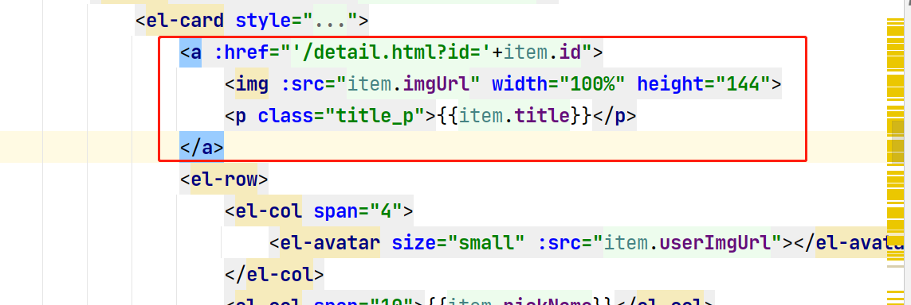
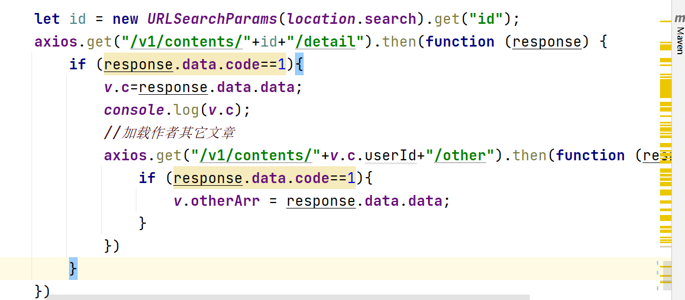
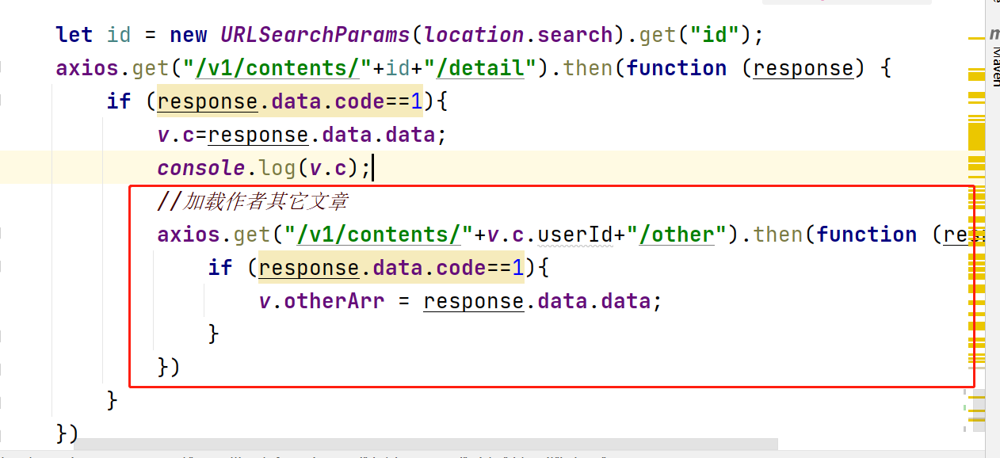
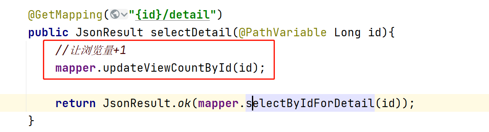

### 首页三个类型下的分类展示

1. 在created方法里面请求三种类型下的分类数据

   ```javascript
   //请求食谱相关分类数据
   axios.get("/v1/categories/1/sub").then(function (response) {
       if (response.data.code==1){
           v.recipeCategoryArr = response.data.data;
       }
   })
   //请求视频相关分类数据
   axios.get("/v1/categories/2/sub").then(function (response) {
       if (response.data.code==1){
           v.videoCategoryArr = response.data.data;
       }
   })
   //请求资讯相关分类数据
   axios.get("/v1/categories/3/sub").then(function (response) {
       if (response.data.code==1){
           v.infoCategoryArr = response.data.data;
       }
   })
   ```

2. 在页面中和分类数组进行绑定

   ```
   <el-menu @select="recipeSelect" mode="horizontal" default-active="0"
            active-text-color="orange">
       <el-menu-item index="0">全部</el-menu-item>
       <el-menu-item v-for="r in recipeCategoryArr" :index="r.id">{{r.name}}</el-menu-item>
   
   </el-menu>
   ```

### 首页三种类型的内容展示

1. 在created方法中请求三种类型的所有数据

   ```java
   //请求三种分类所有的数据中的前4条
   this.loadContent(1,0);
   this.loadContent(2,0);
   this.loadContent(3,0);
   ```

```java
loadContent(type,categoryId){
    //请求食谱所有数据的前4条
    axios.get("/v1/contents/"+type+"/"+categoryId+"/index").then(function (response) {
        if (response.data.code==1){
            switch (type){
                case 1:
                    v.recipeArr = response.data.data;
                    break;
                case 2:
                    v.videoArr = response.data.data;
                    break;
                case 3:
                    v.infoArr = response.data.data;
                    break;
            }
        }
    })
}
```

 2. 在ContentController中处理上面的请求 

    ```java
    @GetMapping("{type}/{categoryId}/index")
    public JsonResult selectIndex(@PathVariable Integer type,
                                  @PathVariable Long categoryId){
        System.out.println("type = " + type + ", categoryId = " + categoryId);
    
        List<ContentIndexVO> list = mapper.selectByTypeAndCategoryId(type,categoryId);
    
        return JsonResult.ok(list);
    }
    ```

3. 当点击每个类型下的分类导航菜单时 需要再次发出请求 

​	

```java
recipeSelect(key,keyPath){
    //key代表二级分类的id
    this.loadContent(1,key);
},
videoSelect(key,keyPath){
  this.loadContent(2,key);
},
infoSelect(key,keyPath){
  this.loadContent(3,key);
},
```


### 点击首页和内容列表页面中的内容时查看详情

1. 给列表中的内容添加超链接 请求地址为 /detail.html?id=xxxx



2. 在detail.html详情页面中 created方法里面得到地址栏中的id,通过id查询内容详情,把得到的数据赋值给data里面的c变量, 让页面中显示的内容和c进行绑定

   

3. 在ContentController中处理上面的请求

   ```java
   @GetMapping("{id}/detail")
   public JsonResult selectDetail(@PathVariable Long id){
       //让浏览量+1
       mapper.updateViewCountById(id);
   
       return JsonResult.ok(mapper.selectByIdForDetail(id));
   }
   ```

### 作者其它文章

1. 在detail.html详情页面中查询到内容详情时 再次发出请求获取当前内容作者相关的其它内容

   

2. 在ContentController里面处理上面的请求

​		

```java
@GetMapping("{id}/detail")
public JsonResult selectDetail(@PathVariable Long id){
    //让浏览量+1
    mapper.updateViewCountById(id);

    return JsonResult.ok(mapper.selectByIdForDetail(id));
}
```

3. 最后在detail.html页面中 让显示的内容和得到的数组进行绑定  

   ```html
   <!--作者其它文章开始-->
   <el-card style="margin: 10px 0">
       <h3>作者其它文章</h3>
       <el-divider></el-divider>
       <el-row gutter="10" v-for="c in otherArr">
           <el-col span="10">
               <a :href="'/detail.html?id='+c.id">
                   
               </a>
           </el-col>
           <el-col span="14">
               <a :href="'/detail.html?id='+c.id">
                   <p class="title_p">{{c.title}}</p>
               </a>
               <i class="el-icon-time">{{c.createTime}}</i>
           </el-col>
       </el-row>
   </el-card>
   <!--作者其它文章结束-->
   ```

### 热门文章步骤同上


### 浏览量

1. 在ContentController中 处理通过id查询详情的方法中 调用mapper里面修改浏览量的方法

   

2. 在ContentMapper中实现上面的方法

   

   ​    


