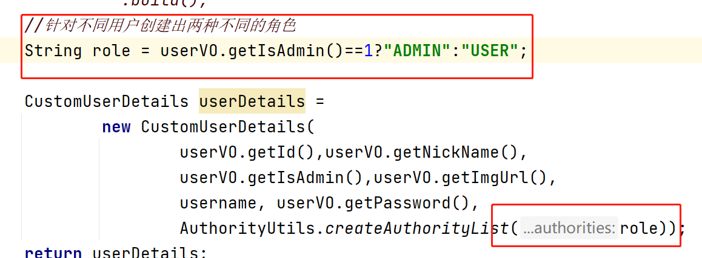
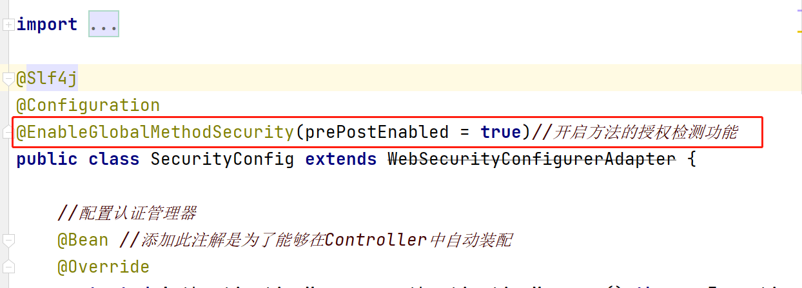
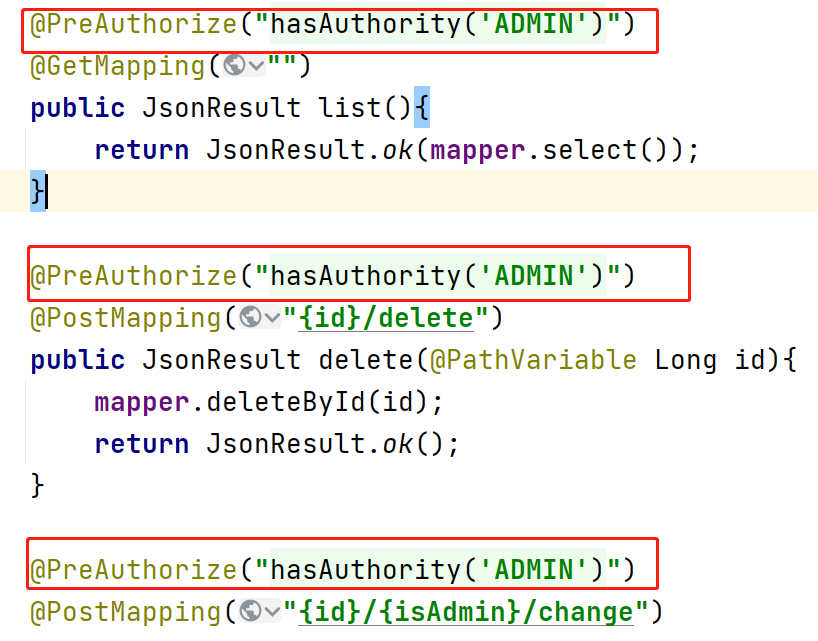
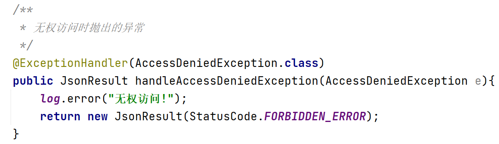

### Security框架授权流程

1. 在登录认证时对当前登录的用户进行授权

   

2. 在Security配置类中添加开启方法授权检测的注解

   

3. 在Controller中的方法上面添加注解判断当前登录的用户是否拥有此权限, 如果没有此权限则抛出异常,在全局异常处理器中进行捕获

   

- 在全局异常处理器中处理异常

  

### Security框架配置路径的通配符

- ?: 代表单个未知字符(不包含/)
  - /v1/?/delete
    - /v1/a/delete
    - /v1/b/delete
- *:代表的是多个未知字符(不包含/)
  - /v1/*/delete
    - /v1/abc/delete
    - /v1/abcd/delete
- **:代表的是多个未知字符(包含/)
  - /v1/**/delete
    - /v1/abc/delete
    - /v1/abcd/delete
    - /v1/abc/delete
    - /v1/a/b/c/d/delete

